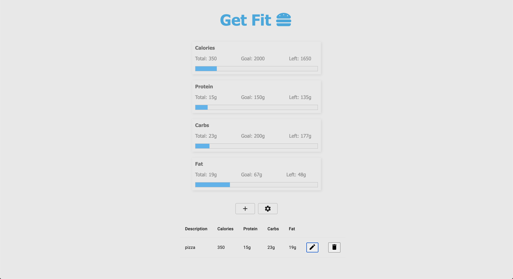
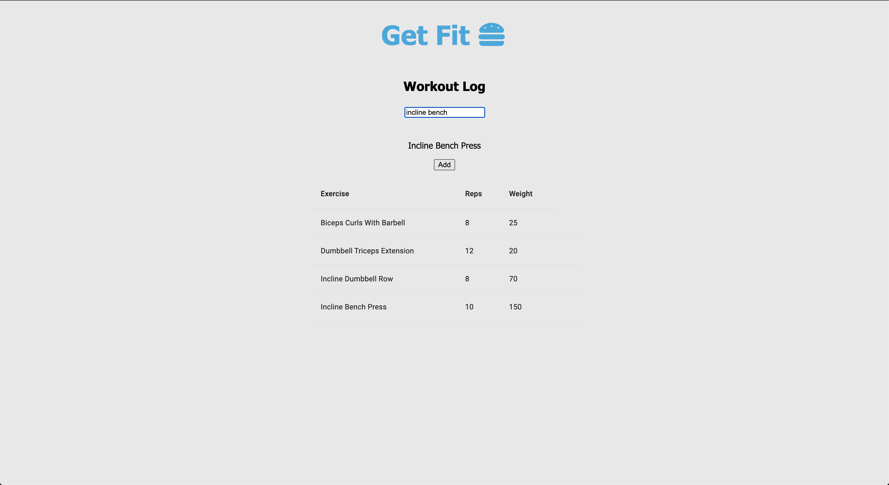

# Get Fit

## Description

Duration: 2 week sprint

Get Fit is a daily nutrition and workout log. It allows the user to keep track of calories, protein, carbohydrates and fat consumed each day. It also allows the user to store and view details of past workout performance.

To use this app, click on the hamburger to access the menu and then navigate to the nutrition or workout page. 

On the nutrition page you are able to edit your nutrient goals by clicking the settings button and add consumed food by clicking the plus button. After adding food, it will appear at the bottom of the screen where you can make edits if needed. 

On the workout page you are able to input a workout and click add. Once added, you will be able to see details of your past performance of that workout. 

To see the fully functional site, please visit: [Get Fit] (https://arcane-scrubland-21211.herokuapp.com/#/workout)

## Prerequisites

Before you get started, make sure you have the following software installed on your computer:

- [Node.js](https://nodejs.org/en/)
- [PostrgeSQL](https://www.postgresql.org/)
- [Nodemon](https://nodemon.io/)

## Installation

- Create a new database called get_fit and create tables with the SQL create table statements provided in the database.sql file. The project is built on Postgres, so you will need to make sure to have that installed. I recommend using Postico to run those queries as that was used to create the queries.

- Open up your editor of choice and run an npm install.

- Run npm run server in your terminal.

- Run npm run client in your terminal. The npm run client command will open up a new browser tab for you.

- Create a .env file at the root of the project and paste this line into the file: SERVER_SESSION_SECRET=secret. Replace secret with some long random string like 25POUbVtx6RKVNWszd9ERB9Bb6 to keep the application secure.

## Built With

- JavaScript
- React
- Redux.js
- Redux Saga
- Express.js
- Node.js
- SQL
- PostgreSQL
- WGER Workout API

## Acknowledgement

Thanks to Prime Digital Academy for equipping and helping me make this application a reality.

